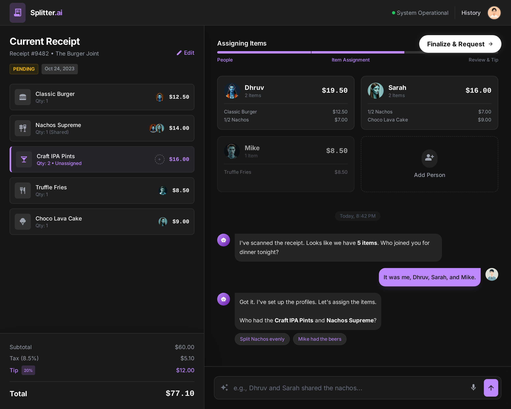

# SPLIT - AI-Powered Bill Splitter 🧾✨


**SPLIT** is a modern, intelligent web application designed to make splitting bills effortless. Upload a receipt, and let our AI parse the items for you. Assign items to friends using natural language chat, and generate instant payment summaries.



## ✨ Features

-   **🤖 AI Receipt Parsing**: Powered by Google Gemini, instantly extracts items and prices from images.
-   **💬 Smart Chat Interface**: Assign items naturally: *"I had the burger and Mike had the beer"*.
-   **⚡ Real-Time Totals**: See everyone's share update instantly as you assign items.
-   **📝 Manual Control**: Edit items, prices, tax, and tip percentages on the fly.
-   **👥 People Management**: Add, rename, and color-code your group members.
-   **📤 One-Click Sharing**: Generate a clean, formatted text summary to paste into WhatsApp/iMessage.
-   **💾 History**: Save your bills locally and reload them anytime.

## 🛠️ Tech Stack


-   **Frontend**: React (TypeScript) + Vite
-   **Styling**: Tailwind CSS (Custom Design System)
-   **AI**: Google Gemini API (Multimodal Vision & Text)
-   **State Management**: React Context API
-   **Build Tool**: Vite

## 🚀 Getting Started

### Prerequisites

-   Node.js (v18+)
-   A Google Gemini API Key ([Get one here](https://aistudio.google.com/app/apikey))

### Installation

1.  **Clone the repository**
    ```bash
    git clone https://github.com/saket-nugget/SPLIT.git
    cd SPLIT
    ```

2.  **Install dependencies**
    ```bash
    npm install
    ```

3.  **Set up Environment Variables**
    Create a `.env` file in the root directory:
    ```env
    VITE_GEMINI_API_KEY=your_api_key_here
    ```

4.  **Run the App**
    ```bash
    npm run dev
    ```
    Open `http://localhost:5173` in your browser.

## 📖 Usage Guide

1.  **Upload**: Drag & drop a receipt image or click "Select Image".
2.  **Edit (Optional)**: Click "Edit" to fix any scanning errors or adjust Tax/Tip.
3.  **Assign**:
    -   Type in the chat: *"Dhruv had the pizza"*
    -   Or click items manually to assign them.
4.  **Review**: Check the "People" tab or the live totals.
5.  **Share**: Click the "Share" button to copy the final breakdown.

## 🔮 Future Scope

-   **💸 Payment Integration**: Direct links to Venmo/UPI.
-   **☁️ Cloud Sync**: User accounts to save history across devices.
-   **📱 Mobile App**: Native React Native version.

## 🤝 Contributing

Contributions are welcome! Please read [CONTRIBUTING.md](CONTRIBUTING.md) for details on our code of conduct and the process for submitting pull requests.

## 📄 License

This project is licensed under the MIT License - see the [LICENSE](LICENSE) file for details.
